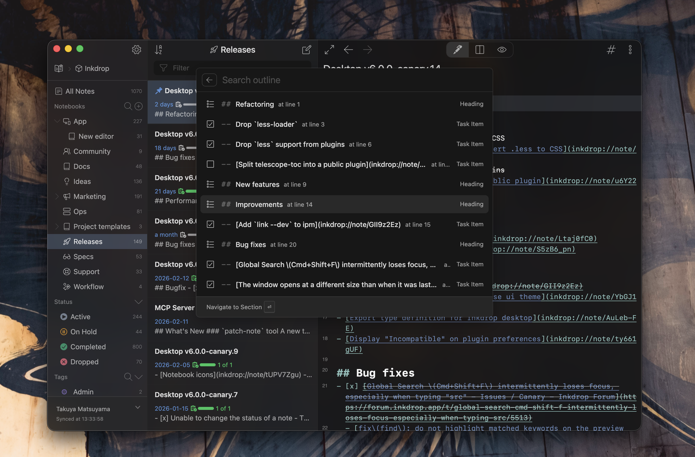

# telescope-toc

A Telescope source plugin for [Inkdrop](https://www.inkdrop.app/) that provides a Table of Contents fuzzy finder.

Quickly navigate to headings and task items in the current note using Telescope.



## Features

- Extracts ATX (`# H1` through `###### H6`) and Setext headings from the current note
- Extracts task items (`- [ ] todo`, `- [x] done`)
- Auto-selects the current section based on cursor position (editor) or scroll position (preview)
- Navigates to the selected item in both editor and preview modes
- Adds a TOC button to the editor header

## Install

```
ipm install telescope-toc
```

## Usage

- Open the command palette and run **Jump to Section...**
- Or use the `#` hash button in the editor header
- Or trigger `telescope-toc:show` via a custom keybinding

## Keybindings

No default keybinding is set. You can add one in your `keymap.cson`:

```cson
'body':
  'cmd-shift-o': 'telescope-toc:show'
```

## Changelog

See [Releases](https://github.com/inkdropapp/telescope-toc/releases).
